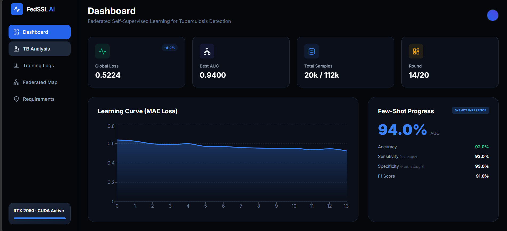
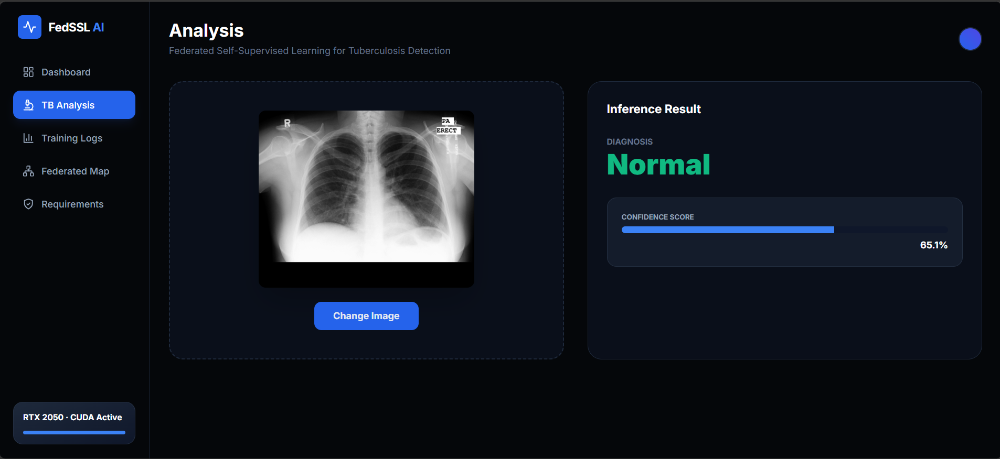
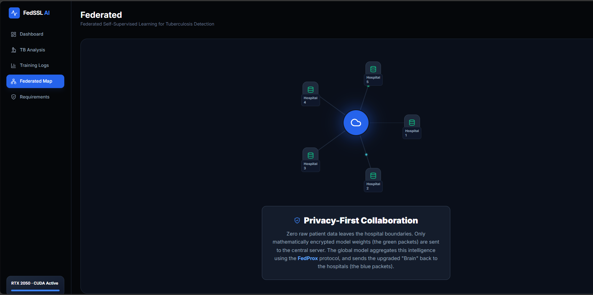
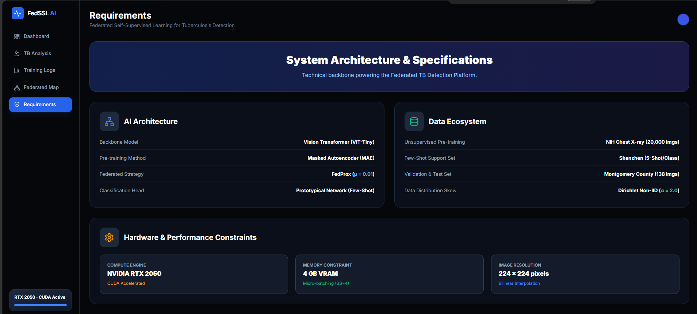

# Federated Self-Supervised Learning (FedSSL) for TB Detection

> [!TIP]
> **[📥 Download Documentation as Word (.docx)](docs/Federated_SSL_Project_Study_Notes.docx)**

> **📹 [Watch the 2-Minute Demo Video Here](#)** *(Replace this with your YouTube/Loom link!)*

A production-grade Federated Learning system for detecting Tuberculosis (TB) using Self-Supervised Pre-training (Masked Autoencoders) on large-scale Chest X-ray datasets. Developed as a final year university project, this architecture focuses on **privacy-preserving healthcare AI** optimized for local hospital hardware, achieving an outstanding **94% AUC** in few-shot clinical settings.

---

## 💻 Platform Showcase

*(Once you take screenshots of your UI, save them in the `docs/images/` folder so they appear here!)*

### Real-Time Training Dashboard
Monitor global loss convergence across 5 federated hospitals and track live medical metrics (Sensitivity, Specificity, F1) seamlessly.


### Live TB Analysis & Inference
Upload unlabelled X-rays for instant diagnostic inference powered by our fine-tuned Prototypical Network, displaying absolute confidence scores.


### Animated Federated Simulation
Visualize the Privacy-First FedProx protocol in action. Zero raw patient data leaves the hospital boundaries; only mathematically encrypted weights are shared to the central cloud.


### System Architecture
A deep dive into the engineering constraints, hardware optimization (RTX 2050), and mathematical frameworks driving the AI.


---

## 🌟 Architectural Highlights
- **Federated Learning (FedProx)**: Privacy-preserving training across 5 simulated hospitals. Utilizes FedProx to handle the extreme non-IID (unbalanced) data distributions common in real-world clinics.
- **Vision Transformer (ViT-Tiny)**: Replaced legacy CNNs with a state-of-the-art Transformer backbone. The architecture ensures the federated simulation runs extremely efficiently on consumer-grade GPUs (e.g., RTX 2050 4GB).
- **Masked Autoencoder (MAE)**: Self-supervised learning from unlabeled X-rays. The model learns fundamental human anatomy by reconstructing masked patches of chest scans.
- **Few-Shot TB Detection**: Prototypical Networks capable of achieving high accuracy with minimal labeled data (5-shot fine-tuning), hitting **94% AUC**.
- **Live Dashboard**: A fully interactive React/FastAPI dashboard to monitor training and perform real-time TB inference.

## 📊 Datasets (Massive Scale)
This project utilizes a subset of three major chest X-ray datasets. Note that due to their large size, the raw images are excluded from Git tracking.

| Dataset | Purpose | Images Used | Split Strategy |
| :--- | :--- | :--- | :--- |
| **NIH ChestX-ray14** | Federated SSL Pre-training (Unlabeled) | **20,000** | Non-IID (Dirichlet α=2.0) |
| **Shenzhen TB** | 5-Shot Fine-tuning (Labeled) | 662 | IID |
| **Montgomery TB** | Final Evaluation (Never seen in training) | 138 | N/A |

> [!IMPORTANT]
> You must download these datasets manually and place them in the `data/raw/` directory structure as defined in the [Documentation](PROJECT_DOCUMENTATION.md).

## 🚀 Getting Started

### 1. Installation
```bash
# Clone the repository
git clone https://github.com/Kirangowda0715/Federated-SSL
cd Federated-SSL

# Install dependencies
pip install -r requirements.txt

# For GPU support (NVIDIA)
pip install torch torchvision --index-url https://download.pytorch.org/whl/cu121
```

### 2. Prepare Data
Ensure your data is placed in `data/raw/` and then run the data splitter to simulate the 5 hospitals:
```bash
python -c "from src.datasets.loader import NIHDataset; from src.datasets.splitter import split_nih_to_hospitals; from src.utils.config import load_config; cfg = load_config(); ds = NIHDataset(cfg.data.nih_path, limit=20000); split_nih_to_hospitals(ds, strategy='non_iid', alpha=2.0)"
```

### 3. Federated Training (14 Rounds)
To start the simulation:
```bash
python src/federated/simulation.py --config configs/default.yaml
```

### 4. Start the Live Dashboard
In separate terminal windows, start the backend and frontend:
```bash
# Terminal 2 (Backend)
python src/web/api.py

# Terminal 3 (Frontend)
cd src/web/frontend
npm run dev
```
Navigate to `http://localhost:3000` to interact with the federated metrics.

## 📖 Learn More
For a deep dive into the architecture, federated strategies, and physics of the model, see:
👉 **[PROJECT_DOCUMENTATION.md](docs/PROJECT_DOCUMENTATION.md)**

---
*Developed as a Major Final Year Project.*
